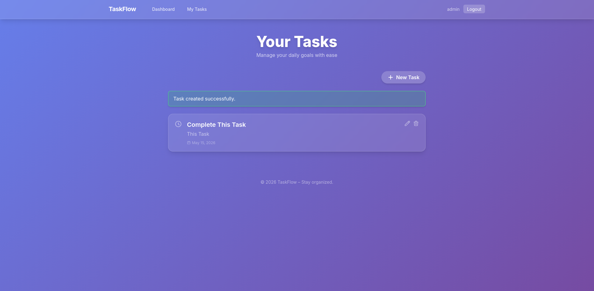

# TaskFlow – Task Manager

[](https://laravel.com)
[](https://php.net)
[](LICENSE)

**TaskFlow** is a modern, secure, and user-friendly task management web application.  
It allows authenticated users to create, read, update, delete, and toggle tasks, with tasks sorted by due date. The UI features a glass‑morphism design with a gradient background, making it look like a standalone product – not just another Laravel app.

![TaskFlow Screenshot]
---

## ✨ Features

- 🔐 **User Authentication** – Register, login, logout (Laravel Breeze with Blade).
- 📝 **Full Task CRUD** – Create, read, update, delete tasks.
- ✅ **One‑click Toggle** – Mark tasks as complete/incomplete instantly.
- 📅 **Sorted by Due Date** – Earliest deadlines first.
- 🛡️ **Authorization** – Users can only edit/delete their own tasks (Laravel Policies).
- 🧼 **CSRF Protection** – All forms include automatic CSRF tokens.
- 🎨 **Modern UI** – Gradient background, glass cards, smooth hover effects, custom navigation.
- 📱 **Responsive** – Works beautifully on desktop, tablet, and mobile.

---

## 🧰 Technology Stack

| Category       | Technology                                      |
|----------------|-------------------------------------------------|
| Backend        | Laravel 13.x (PHP 8.4+)                         |
| Frontend       | Blade templates, Tailwind CSS                   |
| Authentication | Laravel Breeze (Blade stack)                    |
| Database       | SQLite (development) / MySQL (production ready) |
| Build Tools    | Vite, NPM                                       |
| Icons          | Heroicons (SVG)                                 |

---

## 🚀 Installation & Setup

Follow these steps to run the project locally.

### Prerequisites
- PHP >= 8.4
- Composer
- Node.js & NPM
- SQLite (or MySQL)

### Steps

1. **Clone the repository**
   ```bash
   git clone https://github.com/yourusername/TaskManager.git
   cd TaskManager
   ```

2. **Install PHP dependencies**
   ```bash
   composer install
   ```

3. **Install Node dependencies & compile assets**
   ```bash
   npm install
   npm run build   # or npm run dev for development
   ```

4. **Environment configuration**
   ```bash
   cp .env.example .env
   php artisan key:generate
   ```
   - For SQLite: create an empty database file `touch database/database.sqlite` and set `DB_CONNECTION=sqlite` in `.env`.
   - For MySQL: update `.env` with your database credentials.

5. **Run migrations**
   ```bash
   php artisan migrate
   ```

6. **Start the development server**
   ```bash
   php artisan serve
   ```

7. **Visit** `http://127.0.0.1:8000`  
   Register a new account and start managing your tasks.

---

## 📸 Screenshots

*(Add actual screenshots here)*

| Landing Page | Task List | Create Task |
|-------------|-----------|-------------|
|  |  |  |

---

## 🗂️ Database Schema

### `tasks` table

| Column       | Type                | Description                    |
|--------------|---------------------|--------------------------------|
| id           | bigint (PK)         | Auto‑increment                 |
| user_id      | foreignId           | References `users.id` (cascade)|
| title        | string(255)         | Task title (required)          |
| description  | text (nullable)     | Optional details               |
| due_date     | date (nullable)     | Optional deadline              |
| is_completed | boolean             | Default `false`                |
| timestamps   | created_at, updated_at |                               |

---

## 🧪 Testing

Run Laravel’s built-in tests (if any):
```bash
php artisan test
```

Manual testing checklist:
- Register a new user → redirected to dashboard.
- Create a task with title, description, due date.
- See task appear in the list, sorted by due date.
- Click the circle to mark complete → becomes ✅ and strikethrough.
- Edit task → update any field.
- Delete task → confirm deletion.
- Try accessing another user’s task via URL → 403 error (policy works).

---

## 🎨 Customisation

- **Colors & gradients** – Edit the `background` style in `resources/views/layouts/app.blade.php` and `guest.blade.php`.
- **Fonts** – Change the Google Font link in the `<head>`.
- **Logo** – Replace the “TaskFlow” text with your own logo (or use an image).

---

## 📁 Project Structure Highlights

```
TaskManager/
├── app/
│   ├── Http/Controllers/TaskController.php
│   ├── Models/Task.php
│   └── Policies/TaskPolicy.php
├── database/migrations/..._create_tasks_table.php
├── resources/views/
│   ├── layouts/
│   │   ├── app.blade.php
│   │   └── guest.blade.php
│   ├── tasks/
│   │   ├── index.blade.php
│   │   ├── create.blade.php
│   │   └── edit.blade.php
│   └── auth/ (login, register)
└── routes/web.php
```

---

## 🤝 Contributing

Contributions are welcome! Feel free to open an issue or submit a pull request.

1. Fork the repository.
2. Create a feature branch (`git checkout -b feature/amazing-feature`).
3. Commit your changes (`git commit -m 'Add some amazing feature'`).
4. Push to the branch (`git push origin feature/amazing-feature`).
5. Open a Pull Request.

---

## 📄 License

This project is open‑source and available under the [MIT License](LICENSE).

---

## 🙏 Acknowledgements

- [Laravel](https://laravel.com) – The PHP framework.
- [Tailwind CSS](https://tailwindcss.com) – Utility‑first CSS.
- [Heroicons](https://heroicons.com) – Beautiful SVG icons.
- [Google Fonts](https://fonts.google.com) – Inter font.

---

**Built with ❤️ using Laravel and Tailwind CSS.**  
*Stay organized. Stay productive.*

---

## ✅ What to do next

1. **Replace placeholder screenshots** – Take actual screenshots of your app and update the image links.
2. **Add a proper license file** (if not already present) – run `touch LICENSE` and paste MIT text.
3. **Push to GitHub** and enjoy your polished project.

